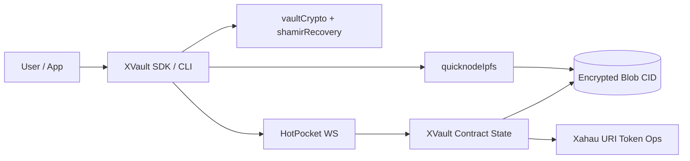

# XVault

[](./LICENSE)


[](https://github.com/Everwood-Technologies/xvault/actions)
[](https://github.com/Everwood-Technologies/xvault/actions)


XVault is a decentralized key locker prototype built for Evernode/HotPocket consensus, with Xahau URI Tokens for on-ledger references and QuickNode IPFS for encrypted blob storage. The contract stores only metadata, authorization state, and content identifiers (CIDs); all sensitive cryptography (key derivation, encryption, key wrapping, and recovery share handling) is performed client-side.

## Key Features

- Individual and team vault modes with deterministic contract state.
- Signed contract operations using Xahau-compatible public key verification.
- Client-side encryption with Argon2id key derivation and AES-256-GCM entry protection.
- Team sharing via per-recipient wrapped entry keys.
- IPFS integration through QuickNode REST upload/unpin helpers.
- Vault revocation flow with URI Token burn and state deletion.
- Client-side Shamir recovery skeleton (optional threshold recovery metadata).
- Thin reusable SDK and optional CLI wrapper for frontend/desktop/Node integrations.

## Security Highlights

- Contract never receives plaintext secrets, recovery shares, or master key material.
- Contract validates signatures, actor authorization, payload formats, CID format, and operation rate limits.
- Team access is enforced in state (`authorized`, `pendingInvites`) and signature checks.
- Recovery operations are client-only; only non-sensitive metadata should be persisted remotely.
- Revocation is state/URI-token focused and does not auto-delete IPFS content (client must unpin if desired).

## Architecture



## Quick Start

### Prerequisites

- Node.js `>=20`
- npm
- Access to:
  - HotPocket contract endpoint (`ws://...`)
  - Xahau/XRPL WebSocket endpoint (`wss://...`)
  - QuickNode IPFS credentials (API key + gateway URL)

### Install

```bash
npm install
```

### Run test suites

```bash
npm test
npm run test:jest
```

### Deployment and cluster validation

Follow the full production-oriented runbook in `docs/deployment.md` for:

- Evernode cluster leasing/provisioning
- contract deployment configuration
- distributed cluster test procedures
- Xahau/IPFS verification steps

### Basic SDK usage

See `examples/sdk-usage.example.js` and `docs/usage-examples.md`.

### CLI usage

```bash
xvault create-vault --type individual
xvault add-entry --vault <vaultId> --service github --username alice --password 'secret'
xvault list
xvault revoke --vault <vaultId>
```

CLI supports configuration from local `.env` and `~/.xvault/config.json`.

## Xaman xApp Client (Web)

A mobile-first xApp web client is available in `xapp/` to connect users from Xaman directly to an XVault service and start vault operations.

Highlights:

- xApp-style aware theming using `xAppStyle` (`light`, `dark`, `moonlight`, `royal`)
- xApp OTT-based service session handshake (`/session/xaman`)
- Vault management UI for create/list/add-entry/revoke flows

See `xapp/README.md` for service API expectations and deployment details.

## Local Cluster Notes

Use Evernode dev tooling to run a local contract cluster and point the SDK `hotpocketWsUrl` to that endpoint. Contract-side cluster specifics are documented in `docs/deployment.md`.

## Production Deployment

High-level sequence:

1. Validate all flows locally and on Xahau testnet first.
2. Provision 3-5 Evernode hosts and deploy the contract bundle.
3. Apply secure environment configuration (`ENABLE_TEAM_MODE=true`, endpoint and secret hygiene).
4. Execute the cluster testing checklist in `docs/deployment.md`.
5. Promote only after successful distributed validation and security review.

Warning: Use testnet first; mainnet deployment requires audit.

## Documentation Index

- Contract handlers and validation rules: `docs/contract-api.md`
- SDK factory and method reference: `docs/sdk-api.md`
- End-to-end flow examples: `docs/usage-examples.md`
- Security assumptions and invariants: `docs/security-model.md`
- Deployment guidance (dev + production): `docs/deployment.md`
- Audit preparation workspace: `docs/audit-prep.md`
- Open-source release checklist: `CHECKLIST.md`
- Contribution guide: `CONTRIBUTING.md`
- Security disclosure policy: `SECURITY.md`
